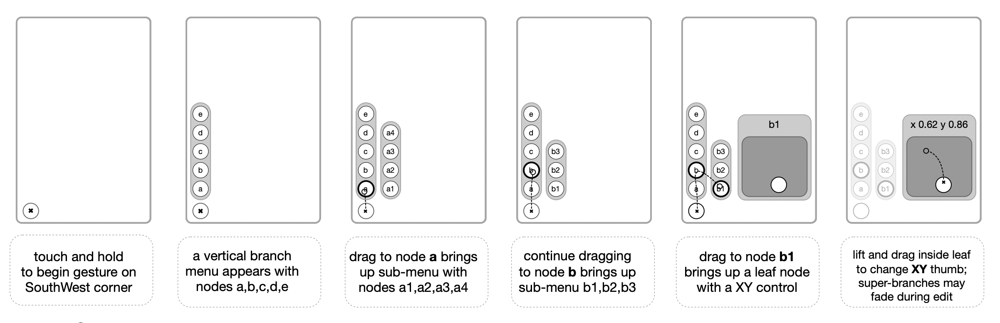
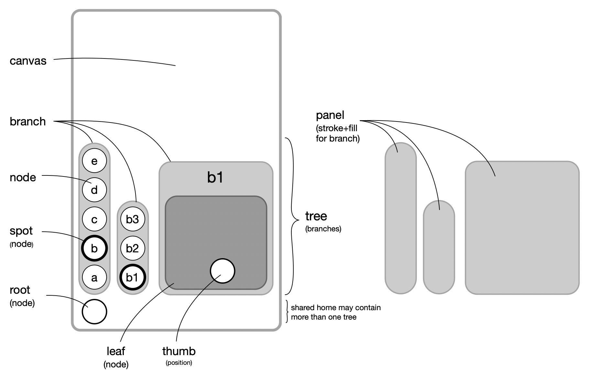

# MuMenu

### Interaction

### Components

### Design

MuMenu is both a namespace tree and controller. Navigating is similar to any other menu trees, with one key difference: it saves your place. Not, only for the last thing you done, but for everthing. The last thing you've done may be several levels deep and yet hovering over its main branch will automatically expend to show where you left off. Or, perhaps something a few days ago -- hovering over its part will reveal it. Automatically. So, each branch bookmarks its sub-branch, and that branch unfolds the sub-sub-branch, and so on. 

For example, let's say you have a 5^5 menu, averaging 5 choices and goes 5 levels deep. That would allow you to track 3,123 choices. With eye-tracking, that choice could be made in less than a second. Maybe. Perhaps, similar gains with an 8^8 menu wrapping 16 million choice? We don't know. It hasn't been tested. Yet. 

### Status

For now, MuMenu works with a toy: a visual Music synthesizer, called Deep Muse. The goal is to wrap about 2000 real-time parameters. It currently works on iOS and iPadOS, and a simulator for visionOS. 

The eyetracking and handpose is not yet available.

#### Naming convention for components
DeepMenu follows a MVVM pattern (Model, View, View Model) 

+ MuFloNode* - proxy for Model, such as MuNodeFlo
+ Mu*View - SwiftUI View for [root,tree,branch,panel,node,leaf] 
+ Mu*Vm   - View Model for [root,tree,branch,panel,node,leaf] 

##### MuRoot* - starting point for one of more MuTree(s)
+ MuRootVm - touch, corner, pilot, trees, branchSpot, nodeSpot
+ MuRootView - manage UIViews for each corner 
+ MuRootStatus - publish changed state in [root,tree,edit,space]

##### MuTree* - horizontal or vertical hierarcy of MuBranches 
+ MuTreeVm - select MuFloNode, add or remove sub-branches
+ MuTreeView - SwiftUI view collection of MuBranch's 

##### MuBranch* - one level in a hierachy containing MuNodes
+ MuBranchVm - view model of a branch
+ MuBranchView - SwiftUI view collection of MuNodeViews
+ MuBranchPanelView - background panel for MuBranchView
        
##### MuFloNode* - A persistent model of items (shared by many Mu*Vms) 
+ MuFloNode - a generic node, may be shared my many NodeVm's (and views)
+ MuNodeFlo - a node proxy for Flo items 
+ MuNodeVm - a view model for a View, may share a Node from another Vm
+ MuNodeView - a SwiftUI view, has a companion MuNodeVm
+ MuNodeIconView - a subview of MuNodeView for icons
+ MuNodeTextView - a subview of MuNodeView for text
        
##### MuLeaf* - subclass of MuFloNode with a user touch control  
+ MuLeafTap - tap to activate, like a drum pad
+ MuLeafTog - toggle a switch 0 or 1
+ MuLeafSeg - segmented control
+ MuLeafVal - single dimension value
+ MuLeafVxy - 2 dimension xy control
   
##### MuPanel* - stroke+fill branches and bounds for node views
+ MuPanelVm - type, axis, size, and margins for View
+ MuPanelView - SwiftUI background 
+ MuPanelAxisView - vertical or horizontal PanelView 

##### MuTouch* - capture touches which are captured by all branches
  - MuTouch - manage touch's [begin,moved,ended] state plus taps
  - MuTouchVm - state for root and drag nodes
  - MuTouchView - view for root and drag nodes
   
##### Prefixes and Suffixes
+ component instances 
  - *Vm - instance of view model, such as branchVm
  - *Vms - array of [*Vm], such as branchVms
+ point, size, radius, spacing 
  - x* - x in a CGPoint(x:y:)
  - y* - y in a CGPoint(x:y:)
  - w* - width  in CGSize(width:height)
  - h* - height in CGSize(width:height)
  - r* - radius / distance from center of a node
  - s* - spacing between nodes
+ hierarchy
  - spot* - spotlight on current Node or Branch
  - parent* - parent in model hierarchy
  - children* - [child] array in model hierarchy
  - child - current child in for loop
  - super - a parent in a view hierarchy
  - sub - a child in view hierarcy
             
### Relationships between classes and structs 
+ `treeVm ▹▹ branchVm ▹▹ nodeVm ▹ leafVm ◃◃ node`
  - treeVm   to branchVm {1,}   // 1:M array [branchVm]s expanded  
  - branchVm to nodeVm   {1,}   // 1:M a branchVm has 1 or more nodeVms
  - nodeVm   to leafVm   {0,1}  // 1:1 optional leaf
  - leafVm   to node     {1,1}  // 1:1 one branchVm for each nodeVm    
  - node     to leafVm   {0,}   // 1:M may be shared by many or cached

### logging symbols
  - `0.00 🟢` start touch at time 0.00  
  - `0.44 🔴` end touch at delta time 0.44
  - `0.33 🟣¹` single tap (² double, ³ triple, etc)
  - `touch∙(393, 675)` coordinate of touch event
  - `🧺` found cached instance
  - `√` `𐂷` `✎` `⬚` - status: .root .tree .edit .space
  - `V⃝ 1⇨0=0` vertical branch from single level to hidden 
  - `H⃝ 0⇨1=1` horzontal branch from hidden to single level
